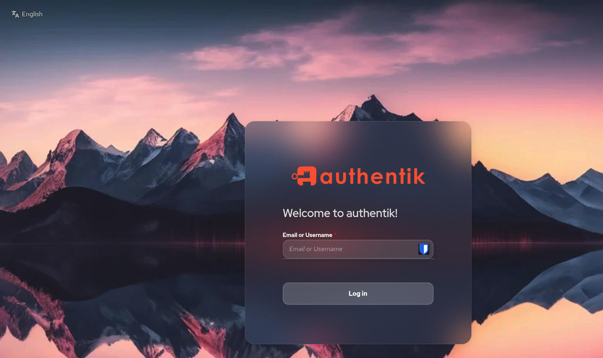
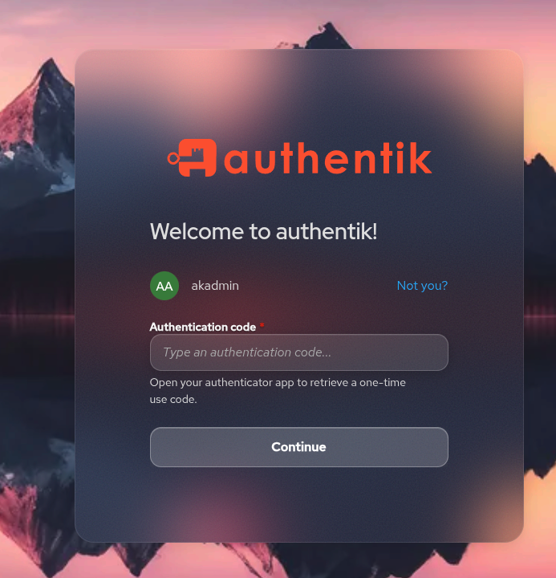
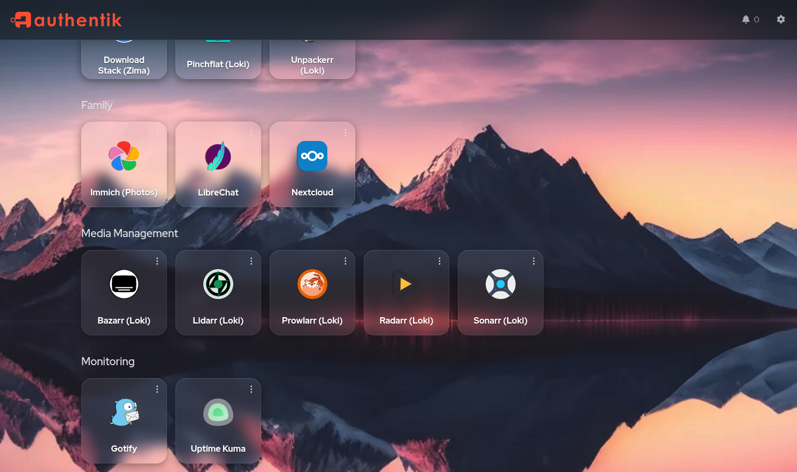
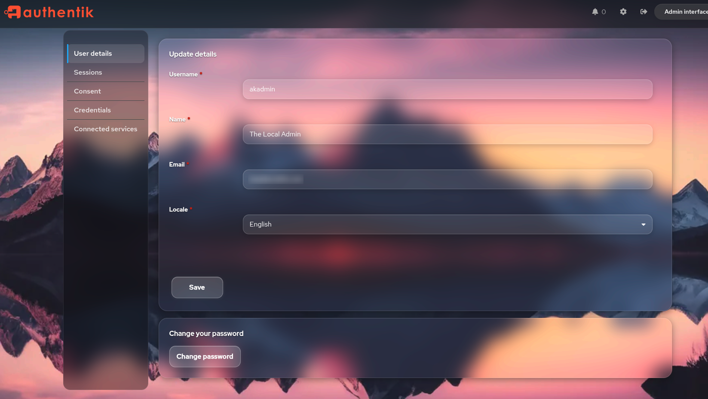

# Authentik Glassy Theme

*Keeping your login pages classy — because they're glassy.*

A frosted-glass CSS theme for [Authentik](https://goauthentik.io/).

Fork by [karubits](https://github.com/karubits), based on
[VULGA01/Authentik-Login-theme-Glassmorphism](https://github.com/VULGA01/Authentik-Login-theme-Glassmorphism).
Reworked for Authentik's Shadow DOM architecture (`adoptedStyleSheets`).

This fork resolves upstream issue
[VULGA01/Authentik-Login-theme-Glassmorphism#5 — Broken in 2025.12.0](https://github.com/VULGA01/Authentik-Login-theme-Glassmorphism/issues/5),
where Authentik's switch to Shadow DOM web components broke the original
theme's selectors. The fork was [announced in the issue thread](https://github.com/VULGA01/Authentik-Login-theme-Glassmorphism/issues/5#issuecomment-4537506840).

**Confirmed working on Authentik 2026.2.x and 2026.5.x.**

## Changes from upstream

The original theme doesn't work out of the box on Authentik 2026.x because
the UI moved to Shadow DOM with `adoptedStyleSheets`. Most of the CSS
selectors silently fail since elements like `.pf-c-login__container` no
longer exist and `.pf-c-login` is now the host element rather than an
inner element. This fork rewrites the selectors to work with the new
architecture.

Main changes:

- Converted `.pf-c-login .pf-c-login__main` to `:host(.pf-c-login) .pf-c-login__main` for Shadow DOM
- Merged glass container styling onto `.pf-c-login__main` since `.pf-c-login__container` no longer exists
- Added document level `body/html` background for login flows (no `.pf-c-page` element on login pages)
- Added CSS variable fallback so the wallpaper shows on the dashboard too, not just login flows
- Fixed invalid CSS `background` shorthand that browsers silently dropped
- Preserved Authentik's native CSS Grid layout instead of overriding with flex
- Scoped button, input, and card styles away from the admin interface
- Fixed skip-to-content accessibility button getting styled as a login button
- Removed orphaned CSS properties that caused parse errors

## What it looks like

### Login


### MFA prompt


### App dashboard


### User settings


## Prerequisites

1. A background image uploaded to Authentik as a **public media file**
   (Admin → System → Brands → edit brand → *Default flow background*).
2. The image must be accessible without authentication. The easiest way is
   to bind-mount the public media directory into the server container so it
   is served at `/static/dist/media/<filename>`:

   ```yaml
   # docker-compose / compose.yml — server service
   volumes:
     - /path/to/authentik/data/media/public:/web/dist/media:ro
   ```

   This makes the file available at
   `https://sso.example.com/static/dist/media/wallpaper.webp`.

## Installation

### Option A — Admin UI (quick)

1. Open **Admin → System → Brands**.
2. Edit your brand.
3. Paste the entire contents of `theme.css` into **Custom CSS**.
4. Save.

### Option B — API (scriptable)

```bash
TOKEN="<your-api-token>"
BRAND_UUID="<your-brand-uuid>"
URL="https://sso.example.com"

# Upload via PATCH
python3 -c "
import json, subprocess
with open('theme.css') as f:
    css = f.read()
with open('/tmp/ak_payload.json', 'w') as f:
    json.dump({'branding_custom_css': css}, f)
"

curl -s -X PATCH \
  -H "Authorization: Bearer $TOKEN" \
  -H "Content-Type: application/json" \
  -d @/tmp/ak_payload.json \
  "$URL/api/v3/core/brands/$BRAND_UUID/"
```

You can find your brand UUID with:

```bash
curl -s -H "Authorization: Bearer $TOKEN" \
  "$URL/api/v3/core/brands/" | python3 -m json.tool
```

## Customisation

Edit the `:root` variables at the top of `theme.css`:

| Variable                       | Purpose                            | Default                              |
|--------------------------------|------------------------------------|--------------------------------------|
| `--ak-flow-background`         | Wallpaper image                    | Falls back to `/static/dist/media/wallpaper9.webp` |
| `--ak-social-separator-text`   | Text between login and social buttons | `"Continue with"`                 |
| `--ak-accent`                  | Accent colour                      | `#d0ced0`                            |

To use a different wallpaper, either:

- Change the fallback URL in `--ak-flow-background`, or
- Upload a new image as the brand's *Default flow background* (Authentik
  will set `--ak-global--background-image` automatically on flow pages).

## How it works (technical notes)

Authentik 2026.x renders most of its UI inside **Shadow DOM** web
components (`ak-flow-executor`, `ak-interface-user`, `ak-library-impl`,
etc.). Custom CSS set via the brand's *Custom CSS* field is injected into
every shadow root through `adoptedStyleSheets`, so it *can* target
elements inside shadow boundaries — but only with the right selectors.

Key points:

- **`:host(ak-stage-identification)`** targets the shadow root of
  `<ak-stage-identification>`, letting you style its internal elements.
- **`.pf-c-login .pf-c-login__main`** does NOT work — `.pf-c-login` is
  the host element, not an inner element. Use
  `:host(.pf-c-login) .pf-c-login__main` instead.
- The login flow has **no `.pf-c-page`** element — only
  `.pf-c-page__drawer`. Background images must go on `body` / `html` or
  `:host(.pf-c-login)::before`.
- There is **no `.pf-c-login__container`** element. The glass effect goes
  directly on `.pf-c-login__main`.
- `--ak-global--background-image` (the JWT-signed wallpaper URL) is only
  injected on **flow pages**, not the dashboard. The CSS uses a `var()`
  fallback to the static media path so the wallpaper also appears on the
  app dashboard.
- Admin interface styles are excluded via
  `:host(ak-interface-admin)` resets.

## AI Disclosure

This theme was developed with assistance from [Hermes](https://github.com/nousresearch/hermes)
and Claude (claude-opus-4-6). AI was used to debug Shadow DOM CSS selector
issues, convert selectors for Authentik 2026.x compatibility, scope styles
away from the admin interface, and write documentation.

A full AI-generated [security review](security-review-260526.md) of the
CSS and documentation has been conducted.

## Contributing

Found a bug or have a fix for a new Authentik version? Contributions are welcome.

- **Issues:** [github.com/karubits/authentik-glassy-theme/issues](https://github.com/karubits/authentik-glassy-theme/issues)
- **Pull requests:** [github.com/karubits/authentik-glassy-theme/pulls](https://github.com/karubits/authentik-glassy-theme/pulls)

## License

[MIT](LICENSE) - free to use, modify, and distribute.

## Credits

Original theme by [VULGA01](https://github.com/VULGA01/Authentik-Login-theme-Glassmorphism) (MIT licence).
